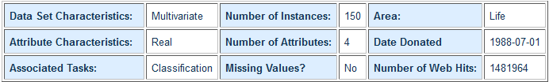

# Análise Iris

Análise do dataset de Iris

[Download: Iris UCI](https://archive.ics.uci.edu/ml/datasets/iris)

## Atributos do dataset

* 1° Coluna: Valores do comprimento da sépalas;
* 2° Coluna: Valores da largula da sépala;
* 3° Coluna: Comprimento da pétala;
* 4° Coluna: Largura da pétala.

## Classes
* Iris Setosa
* Iris Versicolour
* Iris Virginica

## Demais informações

